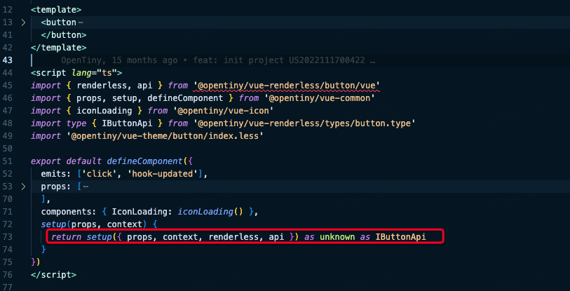
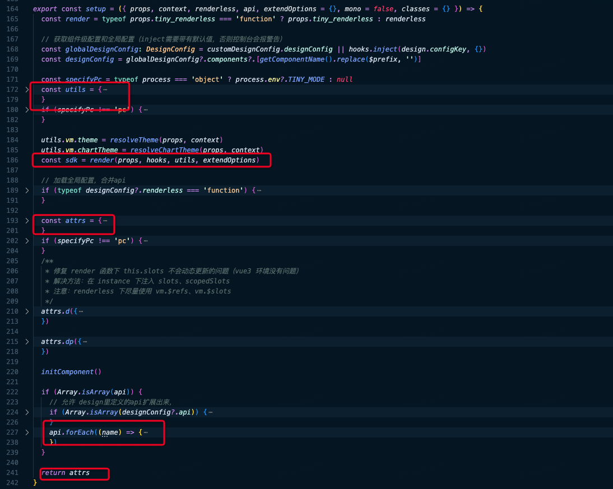

首先以一个button组件为例，组件的左上部分是模板，作为组件的入口，它集成了适配层、renderless逻辑以及theme样式。组件内部并未包含任何逻辑代码，所有逻辑均被抽离至renderless中，

组件模板：



适配层：



组件逻辑：

* 从vue文件（即组件的入口文件）开始，引入了适配层中的setup函数和无状态的renderless函数。setup函数的调用过程中，将包含状态的props和context，以及无状态的纯函数renderless一并传入。
* 然后进入setup函数内部，适配层中的tools函数会构造一个对象，用于抹平框架之间的差异，并将该对象传递给renderless函数。这样，在renderless函数中，可以放心地引用该对象，而无需担心组件是在vue2还是vue3环境下运行。
* 接下来调用纯函数renderless。它为每个组件构造一个与当前组件相关联的state和api，这些都是有状态的值。随后，这些状态值被返回给适配层。
* 最后适配层将这些状态值传递给模板进行绑定。具体而言，state被绑定到模板的数据值上，而api则被绑定到模板的事件上。

整体来看，调用过程就像一个管道，数据从模板开始流动，经过逻辑处理，再流回到模板上。在这个过程中，它流经的适配层巧妙地抹平了框架之间的差异

# 适配层

packages/vue-common/src/index.ts

```
/**
 hooks 从 adapter 引入 virtual:common/adapter/vue
 这里  virtual: 是别名。
 internals/cli/src/config/vite.ts:33
 'virtual:common/adapter/vue': pathFromWorkspaceRoot(`packages/vue-common/src/adapter/vue${vueVersion}/index`)
 设置了 alias ，指向对应版本

 vue2:
  packages/vue-common/src/adapter/vue2/index.ts:10 实现 hooks 指向 @vue/composition-api。 所以打印 hooks，发现 hooks.version 是 1.7.2 (packages/vue-common/src/adapter/vue2/package.json中锁定了版本)
 vue2.7:
 packages/vue-common/src/adapter/vue2.7/index.ts:13 ,直接引用vue，所以version 是2.7.10 (packages/vue-common/src/adapter/vue2.7/package.json中锁定了版本)
 vue3:
 packages/vue-common/src/adapter/vue3/index.ts:12，直接引用vue，所以 version 是 3.x.x

总结hooks主要用于管理Vue的组合式API（Composition API）。这些适配器使得不同版本的Vue可以使用统一的API接口，主要是为了兼容性和代码重用。

 这里有个重要的库，@vue/composition-api。其目的是为了在vue2.7之前的版本使用组合式API
 */
import hooks from './adapter'


/**
 * 
resolveMode 函数的主要作用是确定组件运行的模式。这个函数可以帮助组件根据不同的环境（例如桌面或移动设备）来调整它们的行为或样式。具体来说，这个函数通过以下几个步骤来确定最终的模式：

参数读取：首先，它尝试从组件的 props 中读取 tiny_mode 属性。
注入读取：如果 props 中没有指定，它会尝试从 Vue 的依赖注入系统中读取 TinyMode。
全局配置：如果上述两者都未指定，它会使用全局配置中的 tiny_mode。
函数内部有一个 isRightMode 的辅助函数，用来检查给定的模式是否为有效的模式（目前支持的模式有 'pc', 'mobile', 'mobile-first'）。

最终，如果在 props、注入或全局配置中定义了有效的模式，resolveMode 将返回这个模式。如果这些途径都没有定义有效的模式，则默认返回 'pc'。
此外，如果组件的 props 中设置了 tiny_mode_root 为 true，那么这个模式还会被提供给所有子组件，允许子组件也根据这个模式来调整自己的行为。
这个函数的实现保证了组件能够灵活适应不同的运行环境，使得开发者可以编写更加通用和适应性强的组件。

在web端返回值为pc
 */
export const resolveMode = (props, context) => {
  let isRightMode = (mode) => ~['pc', 'mobile', 'mobile-first'].indexOf(mode)
  let config = rootConfig(context)
  let tinyModeProp = typeof props.tiny_mode === 'string' ? props.tiny_mode : null
  let tinyModeInject = hooks.inject('TinyMode', null)
  let tinyModeGlobal

  // 解决modal、loading、notify 组件（函数式组件，脱离组件树）的内部组件模式判断错误问题。
  if (typeof config.tiny_mode === 'string') {
    tinyModeGlobal = config.tiny_mode
  } else if (config.tiny_mode) {
    tinyModeGlobal = config.tiny_mode.value
  }

  if (!isRightMode(tinyModeProp)) tinyModeProp = null
  if (!isRightMode(tinyModeInject)) tinyModeInject = null
  if (!isRightMode(tinyModeGlobal)) tinyModeGlobal = null

  let tinyMode = tinyModeProp || tinyModeInject || tinyModeGlobal || 'pc'

  if (props.tiny_mode_root) {
    hooks.provide('TinyMode', tinyMode)
  }

  let instance = hooks.getCurrentInstance()

  if (isVue2) {
    instance = instance.proxy
  }

  Object.defineProperty(instance, '_tiny_mode', { value: tinyMode })

  return tinyMode // web端返回 pc
}


/**
在组件初始化时根据当前的 props 和 context 动态决定组件的渲染逻辑和展示内容。
通过使用 Vue 的响应式系统（如 computed）和异步组件机制（defineAsyncComponent），这个函数为构建动态和高度可配置的组件提供了强大的支持
该方法通常会在 packages/vue/src/{组件}/src/index.ts 中被调用。目的就是为了实现pc端和移动端的兼容适配
*/
export const $setup = ({ props, context, template, extend = {} }) => {
  /* 
  1.模式解析：
  调用 resolveMode 函数来确定当前组件的模式（如 'pc', 'mobile'）。该函数基于 props 和 context 来决定最合适的模式。
  */
  const mode = resolveMode(props, context)
  /* 
  2.视图的计算属性：
  使用 Vue 的 computed 创建一个计算属性 view。
  在 view 的计算过程中，首先检查 props.tiny_template 是否被定义。如果已定义，直接使用这个模板。
  如果 props.tiny_template 未定义，会调用 template 函数（packages/vue/src/{组件}/src/index.ts引入pc.vue或者mobile-first.vue）生成一个组件，这个函数接收解析得到的模式和 props 作为参数。
  如果 template 函数返回一个函数（即一个动态组件定义），则使用 defineAsyncComponent 来异步定义这个组件。否则，直接使用返回的组件。
  */
  const view = hooks.computed(() => {
    if (typeof props.tiny_template !== 'undefined') return props.tiny_template

    const component = template(mode, props)

    return typeof component === 'function' ? defineAsyncComponent(component) : component
  })

  /* 
  3.渲染组件：
  调 renderComponent（packages/vue-common/src/adapter/vue3/index.ts） 函数来渲染组件。这个函数接受一个对象，其中包含了计算得到的 view、传递给 $setup 的 props、context 以及一个扩展对象 extend。
  最终调用 h 渲染函数实现组件渲染
  */
  return renderComponent({ view, props, context, extend })
}


/**
 * 
 setup 函数接受一个对象，对象中包含若干属性，重点关注其中 props、context、 renderless、 api 4个属性。该函数在组件 .vue 文件 setup 中被调用，最终返回一个 composition-api 模式下 setup 函数中需要返回的对象
 这么做的目的有两个：
 1、抹平不同vue版本之间的插件
 2、setup函数中提供公共方法
  
 函数整体逻辑：
 1、定义render方法，通常来自于组件对应的renderless方法
 2、获取组件级配置和全局配置，定义utils工具方法
 3、执行render方法获取sdk
 4、定义返回对象基础模板 attrs，包括工具方法、国际化等
 5、遍历组件renderless中定义的api集合，合并到attrs，通常包括state和事件等
 6、返回attrs对象


以组件 carousel 为例
packages/vue/src/carousel/src/pc.vue:102 调用以下 setup 函数返回一个对象，即 composition-api 模式下 setup 函数中需要返回的对象
 */
export const setup = ({ props, context, renderless, api, extendOptions = {}, mono = false, classes = {} }) => {
  /**
  render (packages/vue-common/src/index.ts:165 ) : 忽略 props.tiny_renderless，即组件中传入的 renderless。packages/vue/src/button/src/pc.vue:45 从 packages/renderless/src/button/vue.ts 中引入相关逻辑
  即render函数指向 packages/renderless/src/carousel/vue.ts:148 定义的 renderless 函数。
   */
  const render = typeof props.tiny_renderless === 'function' ? props.tiny_renderless : renderless

  // 获取组件级配置和全局配置（inject需要带有默认值，否则控制台会报警告）
  const globalDesignConfig: DesignConfig = customDesignConfig.designConfig || hooks.inject(design.configKey, {})
  const designConfig = globalDesignConfig?.components?.[getComponentName().replace($prefix, '')]

  const specifyPc = typeof process === 'object' ? process.env?.TINY_MODE : null
  const utils = {
    $prefix, // 字符串，通常用作组件命名的前缀，帮助确保组件名的全局唯一性。
    t, // 一个函数，用于国际化和本地化，通常用来翻译文本。
    ...tools(context, resolveMode(props, context)), // 展开了由 `tools` 函数返回的对象，该函数根据当前上下文和模式提供各种实用工具和服务。
    designConfig, // 一个对象，包含特定于当前组件的设计配置，可能包括样式、行为等设置。
    globalDesignConfig, // 一个对象，包含全局的设计配置，影响整个应用的组件。
    useBreakpoint // 一个函数或钩子，用于根据当前的屏幕尺寸或视口特性来调整组件的布局或行为。
  }
  if (specifyPc !== 'pc') {
    utils.mergeClass = mergeClass
  }

  utils.vm.theme = resolveTheme(props, context)
  utils.vm.chartTheme = resolveChartTheme(props, context)
  /**
  render函数通常来自于组件的renderless方法。
    props:组件接受的props
    hooks:不同版本vue对应的hooks，用于管理Vue的组合式API。这样在组件rederless方法中可以使用 ref、reactive、watch、computed、 生命周期等 composition api
    utils: 工具方法。常用的：vm, parent, emit, constants, childrenHandler, dispatch, slots 
    extendOptions

    通过调用 renderless 方法，返回一组模板需要的api。最终在后续 packages/vue-common/src/index.ts:222编译api，合并到attrs，返回.vue单文件组件 setup 需要的对象，会暴露给模板和组件实例
   */
  const sdk = render(props, hooks, utils, extendOptions)

  // 加载全局配置，合并api
  if (typeof designConfig?.renderless === 'function') {
    Object.assign(sdk, designConfig.renderless(props, hooks, utils, sdk))
  }

  const attrs = {
    t,
    vm: utils.vm,
    f: bindFilter,
    a: filterAttrs,
    d: utils.defineInstanceProperties,
    dp: utils.defineParentInstanceProperties,
    gcls: (key) => getElementCssClass(classes, key)
  }
  if (specifyPc !== 'pc') {
    attrs.m = mergeClass
  }
  /**
   * 修复 render 函数下 this.slots 不会动态更新的问题（vue3 环境没有问题）
   * 解决方法：在 instance 下注入 slots、scopedSlots
   * 注意：renderless 下尽量使用 vm.$refs、vm.$slots
   */
  attrs.d({
    slots: { get: () => utils.vm.$slots, configurable: true },
    scopedSlots: { get: () => utils.vm.$scopedSlots, configurable: true }
  })

  attrs.dp({
    slots: { get: () => utils.parent.$slots, configurable: true },
    scopedSlots: { get: () => utils.parent.$scopedSlots, configurable: true }
  })

  initComponent()

  if (Array.isArray(api)) {
    // 允许 design里定义的api扩展出来，
    if (Array.isArray(designConfig?.api)) {
      api = api.concat(designConfig.api)
    }
    api.forEach((name) => {
      const value = sdk[name]

      if (typeof value !== 'undefined') {
        attrs[name] = value
        // 只有单层组件，才需要给setup传递： mono:true
        // 双层组件，需要把内层的api复制到外层，这样用户应用的ref才能拿到组件的api
        if (!mono) {
          utils.setParentAttribute({ name, value })
        }
      }
    })
  }

  return attrs
}

```
